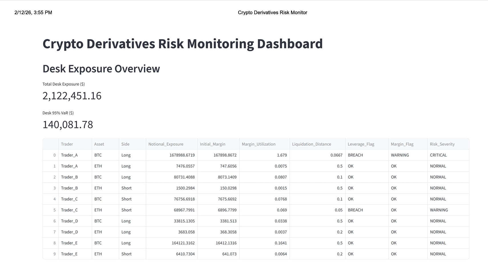

# Crypto Derivatives Risk Monitoring System

## Overview
This project implements an institutional-style **Crypto Derivatives Risk Monitoring System** designed to simulate how trading firms monitor leveraged futures portfolios across trading desks. The system ingests market price data, generates simulated derivatives positions, calculates portfolio risk metrics, and presents real-time monitoring through an interactive Streamlit dashboard.

The platform focuses on **risk surveillance workflows used by middle-office and risk operations teams**, including exposure monitoring, margin utilization tracking, liquidation risk estimation, and portfolio-level risk escalation.

---
## Dashboard Preview

### Desk Exposure Overview


### Margin Utilisation Monitoring


### Risk Severity Panel


## Key Features

### Derivatives Risk Monitoring
- Leveraged futures-style position simulation across multiple traders  
- Notional exposure monitoring at trader and desk levels  
- Margin utilization tracking and breach detection  
- Dynamic liquidation distance calculation based on leverage  

### Portfolio Risk Controls
- Risk severity classification (Normal / Warning / Critical)  
- Concentration risk monitoring by asset and trader  
- Desk-level 95% Value-at-Risk (VaR) estimation  
- Stress scenario testing for high-leverage exposures  

### Monitoring Dashboard
- Interactive Streamlit dashboard for real-time surveillance  
- Exposure, margin, and concentration visualizations  
- Automated breach alerts and escalation panels  
- Portfolio stress scenario visualization  

---

## Project Architecture

```
crypto-derivatives-risk-monitor/
│
├── data/
│   ├── btc_perp_prices.csv
│   ├── eth_perp_prices.csv
│   └── simulated_positions.csv
│
├── risk_engine/
│   ├── risk_engine.py
│   ├── concentration_risk.py
│   └── severity_engine.py
│
├── streamlit dashboard/
│   ├── streamlit_app.py
│   └── streamlit screenshots
|       ├── Desk Exposure Overview.jpg
│       ├── Margin Utilisation.jpg
│       ├── Risk Monitor.jpg
│       └── Risk Severity.png
├── reports/
│   ├── daily_risk_report.csv
│   ├── daily_risk_report_with_severity.csv
│   ├── asset_concentration.csv
│   └── trader_concentration.csv
│
└── README.md
```

---

## Risk Policy Assumptions
- Maximum leverage policy threshold: 10x  
- Margin utilization warning threshold: 70%  
- Margin utilization critical threshold: 85%  
- Concentration monitoring across traders and assets  
- Portfolio VaR estimated using historical volatility proxy  
- Stress scenarios simulate leveraged portfolio shocks  

---

## Technologies Used
- Python (Pandas, NumPy)  
- Streamlit (Dashboard Interface)  
- Financial Risk Modeling Concepts (VaR, Margin Surveillance, Liquidation Modeling)  

---

## Objective
The objective of this project is to demonstrate an operational **derivatives risk surveillance framework** similar to those used in institutional trading environments. The system highlights how trading desks monitor exposure, enforce margin controls, detect risk breaches, and escalate portfolio risk conditions in real time.

---

## Future Enhancements
- Real-time exchange API integration  
- Monte Carlo VaR modeling  
- Funding-rate and mark-price integration for perpetual futures  
- Automated daily risk reporting and alert notifications  

---

## Author
Developed as part of an operations-focused trading infrastructure portfolio to demonstrate applied experience in trade lifecycle monitoring, derivatives risk surveillance, and operational risk control systems.

